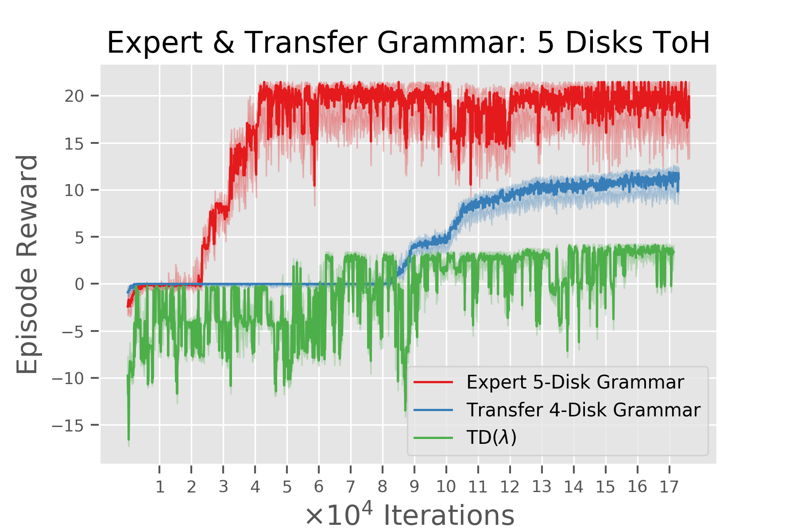
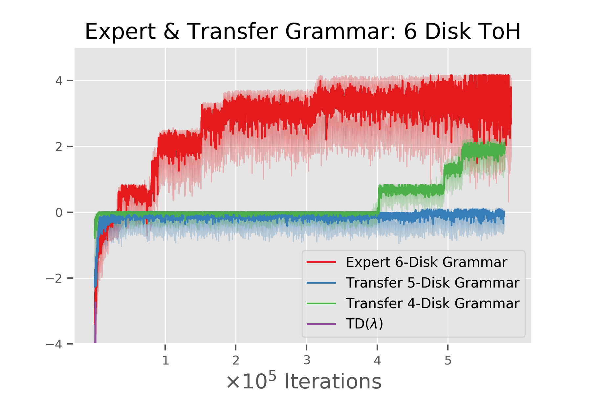
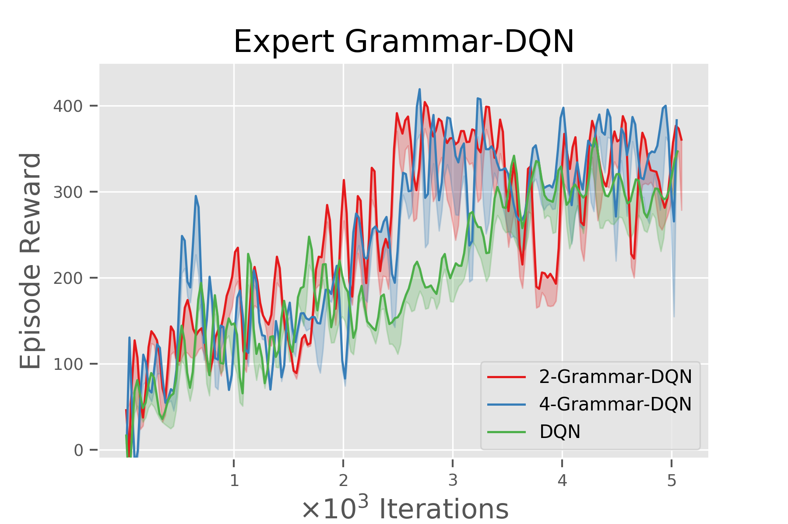
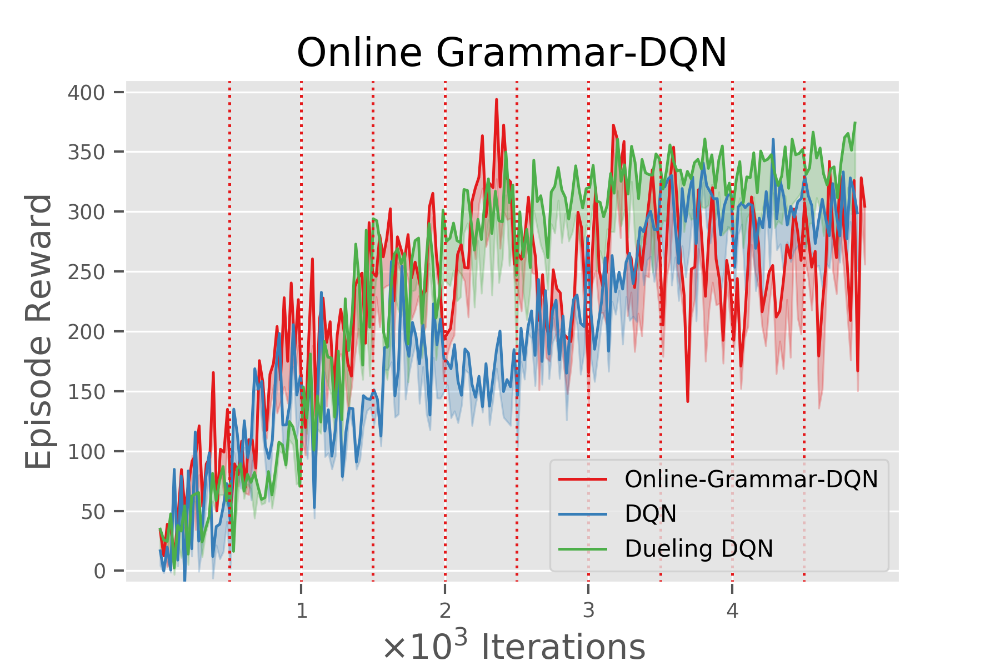

# Action Grammars: A Grammar-Induction Based Method for Learning Temporally-Extended Actions
## Authors: Robert Lange & Aldo Faisal | July 2019

Implementation of [CCN 2019 accepted paper](https://arxiv.org/abs/1907.12477). For the full paper click here. In this work we combine Hierarchical Reinforcement Learning and Grammar induction algorithms in order to define temporal abstractions. These can then be used to alter the action space of the Reinforcement Learning agent.

This work originated during a MSc project at the FaisalLab at Imperial College London.

<p float="center">
  
  
  
  
</p>


## Repository Structure
```
Action Grammars
+- agents: Folder containing implemented agents
+- docs: Paper and illustrative figures
+- grammars: Folder containing grammar utilities
+- utils: Folder containing supporting functions
+- Readme.md: Documentation
+- requirements.txt: Required dependencies
+- run_experiments_grid.sh: Executes gridworld experiments
+- run_experiments_towers.sh: Executes Towers of Hanoi experiments
+- run_learning_grid.py: Learning loop gridworld
+- run_learning_towers.py: Learning loop Towers of Hanoi
+- setup.bash: Setup script installing things
+- visualize_results.ipynb: Visualization of experimental results
```

## (Basic) How to use this code
1. Clone the repo, create/activate venv, install dependencies
```
git clone https://github.com/RobertTLange/action-grammars-hrl
cd action-grammars-hrl
virtualenv -p python AG
source AG/bin/activate
pip install -r requirements.txt
mkdir results
```
2. Install remaining dependencies (Hanoi Env, Sequitur):
```
bash run_experiments.sh setup
```
3. Run the experiments:
```
bash run_experiments.sh towers-of-hanoi
bash run_experiments.sh gridworld
```
4. Visualize the results:
```
jupyter notebook visualize_results.ipynb
```

## Get in touch!

There are many possible avenues that I want to explore in the following months. Feel free to contact me in case of any questions!

August 2019,

Robert Tjarko Lange

## ToDo-List
* [ ] Parallelize over runs
* [ ] Compress learning functions - functional/object oriented programming
* [ ] Add random seed for reproducibility
* [ ] Run experiments over longer time again!
* [ ] Actually look into the grammars - how often used over course of time
* [ ] Fix online towers grammar inference
* [ ] Get grammar inference algorithms working (remote)! + Get Lexis running
* [ ] Better documentation - Comment code and provide better repo structure
